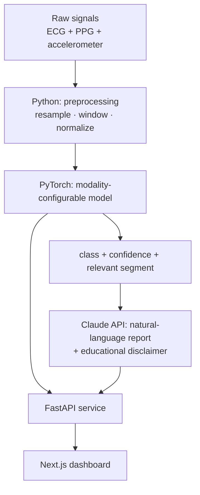

# Multimodal Biosignal Classifier

[](https://github.com/1816x/multimodal-biosignal-classifier/actions/workflows/ci.yml)

> ⚠️ **EDUCATIONAL PROTOTYPE — NOT A MEDICAL DEVICE.**
> This is a learning / portfolio prototype. It is **not** an approved medical or
> diagnostic tool, has **not** been clinically validated, and **must not be used for
> any medical decision**. Model outputs and generated reports are illustrative only.

An end-to-end, **multimodal** biosignal classifier built as a real product slice
rather than a notebook: a PyTorch model consumes time-aligned **ECG + PPG +
accelerometer**, a **FastAPI** service serves predictions, a **Claude API** layer
turns the numeric output into a clinical-*style* natural-language report (always
carrying the disclaimer), and a **Next.js** dashboard visualizes the signal, the
prediction, and the report.

Why not "just another ECG classifier": the GitHub `ecg-classification` topic has
~189 repos, almost all single-signal training notebooks. This project's angle is
(a) **two+ aligned signals** instead of one, (b) delivered as a **service with a
real API**, and (c) an **LLM explanation layer** — built visibly *with* AI (see
[`docs/design-decisions.md`](docs/design-decisions.md)).

## Architecture



## Dataset

**[PPG-DaLiA](https://archive.ics.uci.edu/dataset/495/ppg+dalia)** — UCI Machine
Learning Repository, dataset #495.

| | |
|---|---|
| Modalities | **ECG** (chest, 700 Hz), **PPG/BVP** (wrist, 64 Hz), **3-axis accelerometer** (wrist, 32 Hz) — time-aligned, same subjects |
| Subjects / size | 15 subjects, ~36 h, ~2.6 GB (Python pickle files) |
| Task | Human activity recognition — 8 activities (sitting, stairs, table soccer, cycling, driving, lunch, walking, working) |
| License | **CC BY 4.0** (attribution required) |
| Citation | A. Reiss, I. Indlekofer, P. Schmidt, K. Van Laerhoven, *"Deep PPG: Large-scale Heart Rate Estimation with Convolutional Neural Networks"*, **Sensors**, 2019. |

The dataset is **downloaded, never committed** (see `.gitignore`). Why PPG-DaLiA
rather than the classic MIT-BIH: MIT-BIH is ECG-only with no aligned PPG, so it
cannot support a genuine multimodal model on its own. Full rationale in
[`docs/design-decisions.md`](docs/design-decisions.md).

## Repository layout

```
model/       Python — signal preprocessing + PyTorch model
api/         Python — FastAPI service (health/info + multimodal POST /predict + Claude report POST /report)
dashboard/   TypeScript / Next.js — dashboard: signal plots + prediction + report (Phase 4)
docs/        design decisions + architecture notes
docker-compose.yml   full stack (api + dashboard) — `docker compose up`
MODEL_CARD.md        model card — intended use, honest metrics, limitations
```

## Roadmap

| Phase | Scope | Status |
|------:|-------|--------|
| 0 | Scaffolding: structure, README, disclaimer, design docs | ✅ done |
| 1 | Minimal **ECG-only** model + prediction endpoint | ✅ done |
| 2 | Add **PPG + accelerometer** (multimodal) + preprocessing tests | ✅ done |
| 3 | **Claude API** explanation layer + prompt/disclaimer design | ✅ done |
| 4 | **Next.js** dashboard | ✅ done |
| 5 | `v0.1.0` release + honest metrics (incl. limitations) + CI + Docker | ✅ done |
| — | **v0.2** — model quality: augmentation, dropout, LR schedule, confidence calibration, all-15 retrain (test **0.650 → 0.776**; `walking` F1 **0.36 → 0.81**) | ✅ done |

## Quickstart (development)

Requires Python ≥ 3.10 and Node ≥ 20.

```bash
# Model package (+ PyTorch for training, from Phase 1)
pip install -e "model[train,dev]"

# 1. Fetch PPG-DaLiA (~2.6 GB, CC BY 4.0) into ./data — downloaded, never committed
python model/scripts/download_data.py

# 2. Train the multimodal classifier (all 15 subjects; a few min on CPU)
python -m biosignal_model.train              # phase 2 (multimodal); --phase 1 = ECG-only baseline, --smoke = fast check
#   -> writes model/checkpoints/multimodal_phase2.pt  and  model/metrics/phase2_multimodal.json

# 3. Serve it: health + info + POST /predict + POST /report
pip install -e "api[dev,predict,explain]"    # explain adds the Claude SDK for /report
uvicorn biosignal_api.main:app --reload      # http://127.0.0.1:8000  ->  / · /health · /predict · /report · /docs

# One 8 s window per modality (ECG/PPG = 512 samples; ACC = 512 [x,y,z] triples) -> activity + confidence + disclaimer
curl -s -X POST localhost:8000/predict -H 'content-type: application/json' \
     -d "$(python -c 'import json;print(json.dumps({"ecg":[0.0]*512,"ppg":[0.0]*512,"acc":[[0.0,0.0,0.0]]*512}))')"

# Same input to /report also returns a Claude-generated natural-language report (needs ANTHROPIC_API_KEY)
curl -s -X POST localhost:8000/report -H 'content-type: application/json' \
     -d "$(python -c 'import json;print(json.dumps({"ecg":[0.0]*512,"ppg":[0.0]*512,"acc":[[0.0,0.0,0.0]]*512}))')"

pytest model/ api/

# 4. Dashboard (Phase 4): visualize the window + prediction + report (Next.js)
cd dashboard && npm install && npm run dev   # http://localhost:3000
#   Runs with NO backend using badged synthetic/demo data; to use the live API set
#   API_BASE_URL in dashboard/.env.local (defaults to http://127.0.0.1:8000).
```

`POST /predict` returns **503** until the model is trained (checkpoint present), so
health/info work standalone. `POST /report` additionally needs the report layer
configured — set `ANTHROPIC_API_KEY` (and optionally `ANTHROPIC_MODEL`) in `.env`, else
it returns **503** too. Copy `.env.example` to `.env` to override `DATA_DIR` /
`MODEL_CHECKPOINT` and set the Claude API key.

## Deployment

The whole stack runs with **Docker Compose** — no external accounts:

```bash
docker compose up --build
#   dashboard -> http://localhost:3000   ·   api -> http://localhost:8000
```

Without a trained checkpoint mounted, the API returns **503** and the dashboard shows
its badged demo data — the intended honest default. Mount a checkpoint (uncomment the
`volumes` block in `docker-compose.yml`) and set `ANTHROPIC_API_KEY` for real
predictions and reports.

## Model metrics

The full **[`MODEL_CARD.md`](MODEL_CARD.md)** covers intended use, limitations, and
per-class numbers; the dashboard surfaces the headline figures in an "About this model" panel.

**Phase 1 — ECG-only, 8-class activity recognition on PPG-DaLiA.** Reported
**honestly**, including limitations, and not inflated. Full numbers (per-class,
confusion matrix, hyperparameters) live in
[`model/metrics/phase1_ecg.json`](model/metrics/phase1_ecg.json); reproduce with
`python -m biosignal_model.train --phase 1`.

- **Split is by subject** (train S1–S11, val S12–S13, **test S14–S15**) — no window
  from a test subject is ever seen in training. This is the honest setup: PPG-DaLiA's
  adjacent windows are highly correlated, so a random split would report a much
  rosier (and misleading) number.
- Chance for 8 balanced classes is 12.5%. Loss is class-weighted to counter the
  strong activity imbalance (`lunch_break` alone is ~30% of windows).

| Split | Accuracy | Macro F1 | Weighted F1 | n |
|---|---|---|---|---|
| Validation (S12–S13) | 0.463 | 0.498 | 0.433 | 6,334 |
| **Test (held-out S14–S15)** | **0.609** | **0.645** | 0.620 | 6,134 |

Per-class on the test set (F1): `sitting` 0.93, `cycling` 0.89, `stairs` 0.74,
`driving` 0.68, `walking` 0.66, `working` 0.61, `lunch_break` 0.43, `table_soccer`
0.20. A ~53k-parameter 1-D CNN, trained in ~6 min on CPU.

**Honest read.** ~0.61 test accuracy is ~5× chance — the ECG carries a real activity
signal (exertion drives heart rate), but ECG alone can't see *motion*, so `table_soccer`
(F1 0.20) stays hard and the motion classes are capped. This is exactly the ceiling
Phase 2 lifts: the wrist **accelerometer + PPG** observe movement directly. (Per the
project plan the tests cover deterministic preprocessing; model quality is documented
here with metrics, not asserts.)

### Phase 2 — multimodal (ECG + PPG + accelerometer)

Fusing the wrist **PPG + 3-axis accelerometer** with the ECG lifts test accuracy to
**0.776** on the held-out subjects (S14–S15) — a head-to-head gain over ECG-only's
**0.609** on the *same* subjects and pipeline. Full numbers in
[`model/metrics/phase2_multimodal.json`](model/metrics/phase2_multimodal.json); reproduce
with `python -m biosignal_model.train` (multimodal is the default).

| Model | Split | Accuracy | Macro F1 | Weighted F1 | n |
|---|---|---|---|---|---|
| ECG-only (Phase 1) | Test (S14–S15) | 0.609 | 0.645 | 0.620 | 6,134 |
| **Multimodal (Phase 2)** | **Test (S14–S15)** | **0.776** | **0.814** | **0.761** | **6,134** |
| Multimodal (Phase 2) | Validation (S12–S13) | 0.768 | 0.796 | 0.760 | 6,334 |

Per-class **test F1, multimodal vs ECG-only**: `cycling` 1.00 (was 0.89), `driving`
**0.93 (0.68)**, `table_soccer` **0.89 (0.20)**, `sitting` 0.85 (0.93), `stairs` 0.84 (0.74),
`walking` **0.81 (0.66)**, `lunch_break` 0.71 (0.43), `working` 0.47 (0.61). A ~158k-parameter
model — one 1-D CNN encoder per modality, late-fused — trained in ~14 min on CPU.

**Honest read (v0.2).** The accelerometer supplies the *motion* signal ECG lacks, so the
motion-heavy classes jump (`walking` 0.81, `table_soccer` 0.89, `driving` 0.93). Data
augmentation + dropout + a cosine LR schedule closed the old overfitting gap: the best
validation now lands at **epoch ~10** (was epoch 2) and **test (0.776) ≈ validation
(0.768)**. Confidence is **temperature-calibrated** (T≈1.6, fit on validation) so the
reported number is honest. Still not solved — **`working` is now the weakest class
(F1 0.47)**, confused with `lunch_break` (both sedentary desk activities), and ECG-only
actually reads `working`/`sitting` slightly better. This run trains on **all 15 subjects**
(S1–S11 incl. S6 / S12–S13 / S14–S15); the earlier S6-omitted caveat no longer applies.

## Design decisions

See [`docs/design-decisions.md`](docs/design-decisions.md) — what the AI proposed and
was accepted, what was corrected or rejected and why, and what the first design got
wrong. This is a portfolio project about working *with* AI, and that document is the
record of it.

## License

Source code: **MIT** (see [`LICENSE`](LICENSE)). The PPG-DaLiA **dataset** is under
its own **CC BY 4.0** license and must be obtained and attributed separately.
