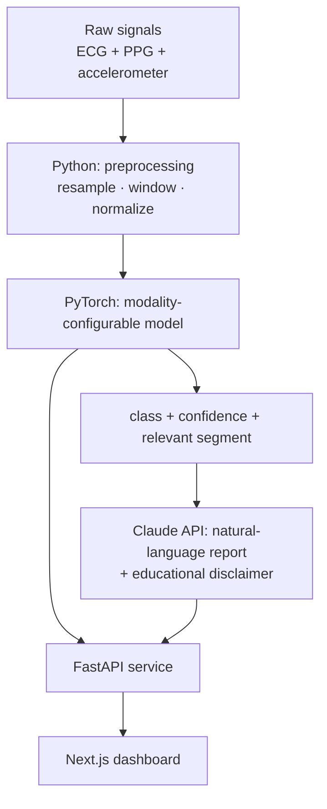

# Multimodal Biosignal Classifier

> ⚠️ **EDUCATIONAL PROTOTYPE — NOT A MEDICAL DEVICE.**
> This is a learning / portfolio prototype. It is **not** an approved medical or
> diagnostic tool, has **not** been clinically validated, and **must not be used for
> any medical decision**. Model outputs and generated reports are illustrative only.

An end-to-end, **multimodal** biosignal classifier built as a real product slice
rather than a notebook: a PyTorch model consumes time-aligned **ECG + PPG +
accelerometer**, a **FastAPI** service serves predictions, a **Claude API** layer
turns the numeric output into a clinical-*style* natural-language report (always
carrying the disclaimer), and a **Next.js** dashboard visualizes the signal, the
prediction, and the report.

Why not "just another ECG classifier": the GitHub `ecg-classification` topic has
~189 repos, almost all single-signal training notebooks. This project's angle is
(a) **two+ aligned signals** instead of one, (b) delivered as a **service with a
real API**, and (c) an **LLM explanation layer** — built visibly *with* AI (see
[`docs/design-decisions.md`](docs/design-decisions.md)).

## Architecture



## Dataset

**[PPG-DaLiA](https://archive.ics.uci.edu/dataset/495/ppg+dalia)** — UCI Machine
Learning Repository, dataset #495.

| | |
|---|---|
| Modalities | **ECG** (chest, 700 Hz), **PPG/BVP** (wrist, 64 Hz), **3-axis accelerometer** (wrist, 32 Hz) — time-aligned, same subjects |
| Subjects / size | 15 subjects, ~36 h, ~2.6 GB (Python pickle files) |
| Task | Human activity recognition — 8 activities (sitting, stairs, table soccer, cycling, driving, lunch, walking, working) |
| License | **CC BY 4.0** (attribution required) |
| Citation | A. Reiss, I. Indlekofer, P. Schmidt, K. Van Laerhoven, *"Deep PPG: Large-scale Heart Rate Estimation with Convolutional Neural Networks"*, **Sensors**, 2019. |

The dataset is **downloaded, never committed** (see `.gitignore`). Why PPG-DaLiA
rather than the classic MIT-BIH: MIT-BIH is ECG-only with no aligned PPG, so it
cannot support a genuine multimodal model on its own. Full rationale in
[`docs/design-decisions.md`](docs/design-decisions.md).

## Repository layout

```
model/       Python — signal preprocessing + PyTorch model
api/         Python — FastAPI service (health/info now; prediction + report later)
dashboard/   TypeScript / Next.js — visualization (Phase 4)
docs/        design decisions + architecture notes
```

## Roadmap

| Phase | Scope | Status |
|------:|-------|--------|
| 0 | Scaffolding: structure, README, disclaimer, design docs | ✅ done |
| 1 | Minimal **ECG-only** model + prediction endpoint | ⬜ planned |
| 2 | Add **PPG + accelerometer** (multimodal) + preprocessing tests | ⬜ planned |
| 3 | **Claude API** explanation layer + prompt/disclaimer design | ⬜ planned |
| 4 | **Next.js** dashboard | ⬜ planned |
| 5 | `v0.1.0` release + honest metrics (incl. limitations) | ⬜ planned |

## Quickstart (development)

Requires Python ≥ 3.10 and Node ≥ 20.

```bash
# API service (health + info endpoints)
pip install -e "api[dev]"
uvicorn biosignal_api.main:app --reload    # http://127.0.0.1:8000  ->  / · /health · /docs

# Model package (config + stubs now; add torch for training from Phase 1)
pip install -e "model[dev]"                # base
pip install -e "model[train]"              # + PyTorch, from Phase 1

pytest model/ api/
```

Copy `.env.example` to `.env` for the Claude API key (used from Phase 3).

## Model metrics

Not yet trained — the model lands in Phases 1–2. Metrics (accuracy, per-class
precision / recall, confusion matrix) will be reported here **honestly**, including
limitations, and will not be inflated. Per the project plan the tests cover the
deterministic preprocessing; model quality is documented with metrics, not asserts.

## Design decisions

See [`docs/design-decisions.md`](docs/design-decisions.md) — what the AI proposed and
was accepted, what was corrected or rejected and why, and what the first design got
wrong. This is a portfolio project about working *with* AI, and that document is the
record of it.

## License

Source code: **MIT** (see [`LICENSE`](LICENSE)). The PPG-DaLiA **dataset** is under
its own **CC BY 4.0** license and must be obtained and attributed separately.
