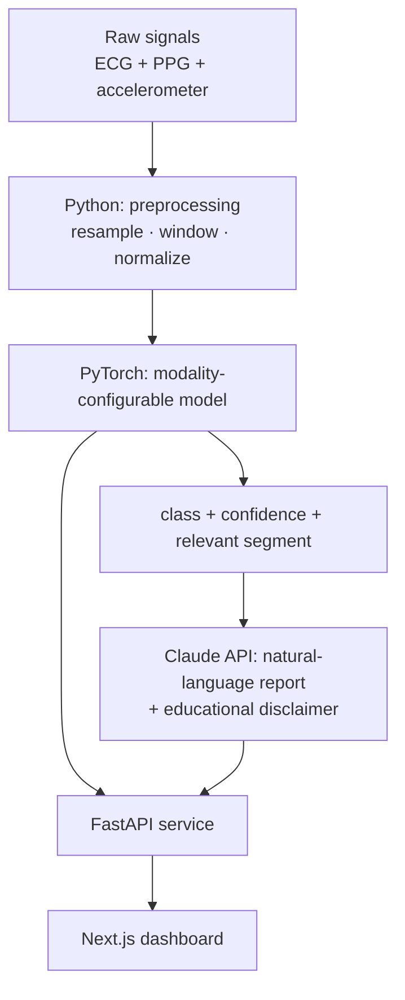

# Multimodal Biosignal Classifier

> ⚠️ **EDUCATIONAL PROTOTYPE — NOT A MEDICAL DEVICE.**
> This is a learning / portfolio prototype. It is **not** an approved medical or
> diagnostic tool, has **not** been clinically validated, and **must not be used for
> any medical decision**. Model outputs and generated reports are illustrative only.

An end-to-end, **multimodal** biosignal classifier built as a real product slice
rather than a notebook: a PyTorch model consumes time-aligned **ECG + PPG +
accelerometer**, a **FastAPI** service serves predictions, a **Claude API** layer
turns the numeric output into a clinical-*style* natural-language report (always
carrying the disclaimer), and a **Next.js** dashboard visualizes the signal, the
prediction, and the report.

Why not "just another ECG classifier": the GitHub `ecg-classification` topic has
~189 repos, almost all single-signal training notebooks. This project's angle is
(a) **two+ aligned signals** instead of one, (b) delivered as a **service with a
real API**, and (c) an **LLM explanation layer** — built visibly *with* AI (see
[`docs/design-decisions.md`](docs/design-decisions.md)).

## Architecture



## Dataset

**[PPG-DaLiA](https://archive.ics.uci.edu/dataset/495/ppg+dalia)** — UCI Machine
Learning Repository, dataset #495.

| | |
|---|---|
| Modalities | **ECG** (chest, 700 Hz), **PPG/BVP** (wrist, 64 Hz), **3-axis accelerometer** (wrist, 32 Hz) — time-aligned, same subjects |
| Subjects / size | 15 subjects, ~36 h, ~2.6 GB (Python pickle files) |
| Task | Human activity recognition — 8 activities (sitting, stairs, table soccer, cycling, driving, lunch, walking, working) |
| License | **CC BY 4.0** (attribution required) |
| Citation | A. Reiss, I. Indlekofer, P. Schmidt, K. Van Laerhoven, *"Deep PPG: Large-scale Heart Rate Estimation with Convolutional Neural Networks"*, **Sensors**, 2019. |

The dataset is **downloaded, never committed** (see `.gitignore`). Why PPG-DaLiA
rather than the classic MIT-BIH: MIT-BIH is ECG-only with no aligned PPG, so it
cannot support a genuine multimodal model on its own. Full rationale in
[`docs/design-decisions.md`](docs/design-decisions.md).

## Repository layout

```
model/       Python — signal preprocessing + PyTorch model
api/         Python — FastAPI service (health/info + multimodal POST /predict + Claude report POST /report)
dashboard/   TypeScript / Next.js — dashboard: signal plots + prediction + report (Phase 4)
docs/        design decisions + architecture notes
```

## Roadmap

| Phase | Scope | Status |
|------:|-------|--------|
| 0 | Scaffolding: structure, README, disclaimer, design docs | ✅ done |
| 1 | Minimal **ECG-only** model + prediction endpoint | ✅ done |
| 2 | Add **PPG + accelerometer** (multimodal) + preprocessing tests | ✅ done |
| 3 | **Claude API** explanation layer + prompt/disclaimer design | ✅ done |
| 4 | **Next.js** dashboard | ✅ done |
| 5 | `v0.1.0` release + honest metrics (incl. limitations) | ⬜ planned |

## Quickstart (development)

Requires Python ≥ 3.10 and Node ≥ 20.

```bash
# Model package (+ PyTorch for training, from Phase 1)
pip install -e "model[train,dev]"

# 1. Fetch PPG-DaLiA (~2.6 GB, CC BY 4.0) into ./data — downloaded, never committed
python model/scripts/download_data.py

# 2. Train the multimodal classifier (all 15 subjects; a few min on CPU)
python -m biosignal_model.train              # phase 2 (multimodal); --phase 1 = ECG-only baseline, --smoke = fast check
#   -> writes model/checkpoints/multimodal_phase2.pt  and  model/metrics/phase2_multimodal.json

# 3. Serve it: health + info + POST /predict + POST /report
pip install -e "api[dev,predict,explain]"    # explain adds the Claude SDK for /report
uvicorn biosignal_api.main:app --reload      # http://127.0.0.1:8000  ->  / · /health · /predict · /report · /docs

# One 8 s window per modality (ECG/PPG = 512 samples; ACC = 512 [x,y,z] triples) -> activity + confidence + disclaimer
curl -s -X POST localhost:8000/predict -H 'content-type: application/json' \
     -d "$(python -c 'import json;print(json.dumps({"ecg":[0.0]*512,"ppg":[0.0]*512,"acc":[[0.0,0.0,0.0]]*512}))')"

# Same input to /report also returns a Claude-generated natural-language report (needs ANTHROPIC_API_KEY)
curl -s -X POST localhost:8000/report -H 'content-type: application/json' \
     -d "$(python -c 'import json;print(json.dumps({"ecg":[0.0]*512,"ppg":[0.0]*512,"acc":[[0.0,0.0,0.0]]*512}))')"

pytest model/ api/

# 4. Dashboard (Phase 4): visualize the window + prediction + report (Next.js)
cd dashboard && npm install && npm run dev   # http://localhost:3000
#   Runs with NO backend using badged synthetic/demo data; to use the live API set
#   API_BASE_URL in dashboard/.env.local (defaults to http://127.0.0.1:8000).
```

`POST /predict` returns **503** until the model is trained (checkpoint present), so
health/info work standalone. `POST /report` additionally needs the report layer
configured — set `ANTHROPIC_API_KEY` (and optionally `ANTHROPIC_MODEL`) in `.env`, else
it returns **503** too. Copy `.env.example` to `.env` to override `DATA_DIR` /
`MODEL_CHECKPOINT` and set the Claude API key.

## Model metrics

**Phase 1 — ECG-only, 8-class activity recognition on PPG-DaLiA.** Reported
**honestly**, including limitations, and not inflated. Full numbers (per-class,
confusion matrix, hyperparameters) live in
[`model/metrics/phase1_ecg.json`](model/metrics/phase1_ecg.json); reproduce with
`python -m biosignal_model.train --phase 1`.

- **Split is by subject** (train S1–S11, val S12–S13, **test S14–S15**) — no window
  from a test subject is ever seen in training. This is the honest setup: PPG-DaLiA's
  adjacent windows are highly correlated, so a random split would report a much
  rosier (and misleading) number.
- Chance for 8 balanced classes is 12.5%. Loss is class-weighted to counter the
  strong activity imbalance (`lunch_break` alone is ~30% of windows).

| Split | Accuracy | Macro F1 | Weighted F1 | n |
|---|---|---|---|---|
| Validation (S12–S13) | 0.466 | 0.495 | 0.465 | 6,334 |
| **Test (held-out S14–S15)** | **0.371** | **0.385** | 0.371 | 6,134 |

Per-class on the test set (F1): `cycling` 0.74, `stairs` 0.61, `sitting` 0.49,
`lunch_break` 0.38, `driving` 0.30, `working` 0.28, `walking` 0.26, `table_soccer`
0.03. A ~53k-parameter 1-D CNN, trained in ~4.5 min on CPU.

**Honest read.** 0.371 test accuracy is roughly **3× chance** — the ECG genuinely
carries an activity signal (exertion raises heart rate, so `cycling`/`stairs`
separate well), but ECG alone can't see *motion*, so posture-similar classes
(`table_soccer`, `working`, `walking`) blur together. The model also overfits the
training subjects (best validation lands early, at epoch 2). This is exactly the
ceiling Phase 2 is meant to lift: the wrist **accelerometer + PPG** observe movement
directly, which is what these confusable classes need. Per the project plan the
tests cover deterministic preprocessing; model quality is documented here with
metrics, not asserts.

### Phase 2 — multimodal (ECG + PPG + accelerometer)

Fusing the wrist **PPG + 3-axis accelerometer** with the ECG lifts test accuracy from
**0.371 → 0.650** on the **same held-out subjects (S14–S15)**, so the comparison is
head-to-head. Full numbers in
[`model/metrics/phase2_multimodal.json`](model/metrics/phase2_multimodal.json); reproduce
with `python -m biosignal_model.train` (multimodal is the default).

| Model | Split | Accuracy | Macro F1 | Weighted F1 | n |
|---|---|---|---|---|---|
| ECG-only (Phase 1) | Test (S14–S15) | 0.371 | 0.385 | 0.371 | 6,134 |
| **Multimodal (Phase 2)** | **Test (S14–S15)** | **0.650** | **0.676** | **0.620** | **6,134** |
| Multimodal (Phase 2) | Validation (S12–S13) | 0.712 | 0.748 | 0.744 | 6,334 |

Per-class **test F1, multimodal vs ECG-only**: `cycling` 0.99 (was 0.74), `table_soccer`
**0.83 (was 0.03)**, `sitting` 0.80 (0.49), `stairs` 0.73 (0.61), `driving` 0.69 (0.30),
`lunch_break` 0.60 (0.38), `working` 0.41 (0.28), `walking` 0.36 (0.26). A ~158k-parameter
model — one 1-D CNN encoder per modality, late-fused — trained in ~13.5 min on CPU.

**Honest read.** The accelerometer supplies exactly the *motion* signal ECG lacked:
`table_soccer` goes from effectively unlearnable (F1 0.03) to 0.83, and every class
improves. But 0.65 is a genuine result, not a solved task — `walking` stays weakest
(recall 0.24, still confused with `stairs`/`sitting`), and the long, sedentary look-alike
desk activities (`working`, `lunch_break`) remain hard. **Environment caveat:** the sandbox
disk held 14 of 15 subject files, so this run trained on **10 of Phase 1's 11 training
subjects** (S6 omitted); validation and test are the **identical** held-out subjects
(S12–S13 / S14–S15), which is what keeps the comparison fair. The exact split is recorded
in the metrics JSON.

## Design decisions

See [`docs/design-decisions.md`](docs/design-decisions.md) — what the AI proposed and
was accepted, what was corrected or rejected and why, and what the first design got
wrong. This is a portfolio project about working *with* AI, and that document is the
record of it.

## License

Source code: **MIT** (see [`LICENSE`](LICENSE)). The PPG-DaLiA **dataset** is under
its own **CC BY 4.0** license and must be obtained and attributed separately.
